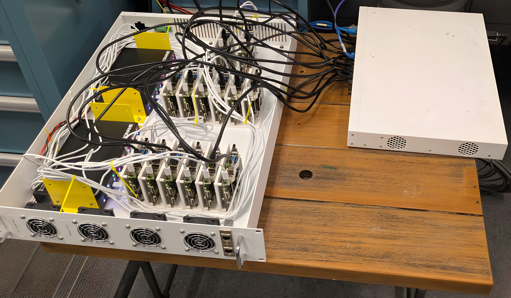

# Qualcomm Cluster v0

A 14-node Kubernetes cluster built from Rubik Pi 3 single-board computers, housed in a donated rack and managed via microk8s.



---

## Hardware

| Component | Model / Details | Qty |
|---|---|---|
| Compute nodes | Rubik Pi 3 | 14 |
| Switch | MikroTik CRS328-24P-4S+RM | 1 |
| Power hubs | Acroname USBHub3c (USB-C PD Hub) | 2 |
| Router | pfSense on a desktop PC | 1 |
| Rack | Donated custom rack (~2U, 19" × 24" × 3.5") | 1 |

**Switch product page:** https://mikrotik.com/product/crs328_24p_4s_rm  
**Power hub product page:** https://acroname.com/store/programmable-industrial-power-delivery-hub-s99-usbhub-3c-pro

### Notes on hardware choices

- The **Acroname hubs** are used solely for USB-C power delivery to the Rubik Pi boards. The monitoring and programmability features of these hubs are not currently used.
- The **MikroTik switch** is configured in **switch mode only** — its router features are disabled. All routing is handled by pfSense.
- **pfSense** runs on a separate desktop machine and serves as the NAT router for the cluster network.

---

## Network Architecture

```
Internet
   |
pfSense (desktop)  ← NAT gateway / DHCP boundary
   |
MikroTik CRS328 (switch mode)
   |-- Node 01 (static IP)
   |-- Node 02 (static IP)
   ...
   |-- Node 14 (static IP)
```

All 14 nodes are on a private subnet behind pfSense. Each node is assigned a **static IP address**. pfSense provides NAT for outbound internet access.

---

## Step 1: Flash Ubuntu 24.04 onto each Rubik Pi 3

Follow the official Thundercomm documentation for flashing:

> https://www.thundercomm.com/rubik-pi-3/en/docs/about-rubikpi/

Use the **Qualcomm Launcher** tool as described in those docs to flash Ubuntu 24.04 to each board. Repeat this process for all 14 nodes.

---

## Step 2: Physical Setup

1. Mount the Rubik Pi boards in the rack.
2. Connect each board to the Acroname USBHub3c for power via USB-C.
3. Run an ethernet cable from each board to a port on the MikroTik switch.
4. Connect the MikroTik switch uplink to the pfSense machine.

> The rack provides approximately 2U of vertical space. The MikroTik switch occupies 1U.

---

## Step 3: Configure the MikroTik Switch

The MikroTik CRS328 is used in **switch mode** with its **default configuration** — no routing, VLANs, or custom port settings are applied. All traffic is bridged to the pfSense router.

No additional switch configuration is required beyond the factory defaults.

---

## Step 4: Configure pfSense

1. Install pfSense on a desktop machine.
2. Assign one NIC as the WAN interface (upstream internet) and one as the LAN interface (connected to the MikroTik switch).
3. Configure the LAN interface with a static IP that will serve as the default gateway for all cluster nodes.
4. Enable NAT on the WAN interface so nodes can reach the internet.

pfSense handles all routing. The MikroTik switch is purely layer 2.

---

## Step 5: Assign Static IPs to Nodes via DHCP Reservations

Static IPs are managed in **pfSense via DHCP static mappings** — the nodes themselves use DHCP. pfSense maps each node's MAC address to a fixed IP, ensuring they always receive the same address.

Node IPs are assigned as follows:

| Node | IP Address |
|---|---|
| Node 1 | 192.168.1.2 |
| Node 2 | 192.168.1.3 |
| ... | ... |
| Node 14 | 192.168.1.15 |

To configure a static mapping in pfSense:

1. Go to **Services → DHCP Server → LAN**
2. Scroll to **DHCP Static Mappings** and click **Add**
3. Enter the node's MAC address, assign the desired IP, and optionally set a hostname
4. Save and apply

Repeat for each of the 14 nodes. No netplan changes are needed on the nodes themselves — leave them configured for DHCP.

---

## Step 6: Install microk8s on All Nodes

On **each node**, install microk8s via snap:

```bash
sudo snap install microk8s --classic
sudo usermod -aG microk8s $USER
newgrp microk8s
```

---

## Step 7: Bootstrap the Control Plane

Choose one node to be the **control plane**. On that node:

```bash
microk8s status --wait-ready
```

Confirm microk8s is running before proceeding.

---

## Step 8: Join Worker Nodes to the Cluster

On the **control plane node**, generate a join token for each worker:

```bash
microk8s add-node
```

This outputs a `microk8s join` command. Copy it and run it on the worker node:

```bash
# On the worker node:
microk8s join <control-plane-ip>:<port>/<token>
```

Repeat for each of the remaining 13 nodes.

---

## Step 9: Verify the Cluster

On the control plane node:

```bash
microk8s kubectl get nodes
```

All 14 nodes should appear with a `Ready` status.

---

## Known Issues and Lessons Learned

### Control plane taint

The control plane node has its **taint preserved** — workloads are not scheduled on the control plane by default. This is standard practice, but with only 14 nodes, it reduces scheduling capacity to 13 workers.

> **Reliability issue:** We initially removed the taint so workloads could be scheduled on the control plane node. This caused reliability problems — workload pressure on the control plane interfered with cluster management. Restoring the taint resolved the issue. Do not remove the taint on the control plane node.

---

## Next Steps

See [`../v1/proposal.md`](../v1/proposal.md) for the v1 proposal, which covers scaling this cluster to 100–200 nodes using a tray-based rack design and centralized power distribution.
